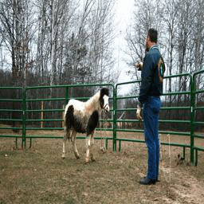

# MISF: Multi-level Interactive Siamese Filtering for High-Fidelity Image Inpainting in CVPR2022

We proposed a novel approach for high-fidelity image inpainting. Specifically, we use a single predictive network to conduct predictive filtering at the image level and deep feature level, simultaneously. The image-level filtering is to recover details, while the deep feature-level filtering is to complete semantic information, which leads to high-fidelity inpainting results. Our method outperforms state-of-the-art methods on three public datasets.
[[ArXiv]](https://arxiv.org/abs/2203.06304)
<br>
<p align="center">
<a href = "https://colab.research.google.com/drive/16mdFLTaBGyeQMO5KErDTClr3gW4WP1di?usp=sharing">
    
</a>
<br>
Try our method in Google Colab
</p>





## Enviroment setup
- Python 3.7
- PyTorch >= 1.0 (test on PyTorch 1.0, 1.7.0)

conda create -n misf_env python=3.7

conda activate misf_env

cd misf

pip install -r requirements.txt

## Dataset

- [Places2 Data of Places365-Standard](http://places2.csail.mit.edu/download.html)
- [CelebA](https://mmlab.ie.cuhk.edu.hk/projects/CelebA.html)
- [Dunhuang]
- [Mask](https://drive.google.com/file/d/1cuw8QGfiop9b4K7yo5wPgPqXBIHjS6MI/view?usp=share_link)

1. For data folder path (CelebA) organize them as following:

```shell
--CelebA
   --train
      --1-1.png
   --valid
      --1-1.png
   --test
      --1-1.png
   --mask-train
	  --1-1.png
   --mask-valid
      --1-1.png
   --mask-test
      --0%-20%
        --1-1.png
      --20%-40%
        --1-1.png
      --40%-60%
        --1-1.png
 ```

 2. Run the code  `./data/data_list.py` to generate the data list

## Architecture details

<br><br>


## Pretrained models

[CelebA](https://drive.google.com/drive/folders/14QVgtG5nbk5e00QRqEJBlBM5Q-aHF5Bd?usp=sharing)

[Places2](https://drive.google.com/drive/folders/14QVgtG5nbk5e00QRqEJBlBM5Q-aHF5Bd?usp=sharing)

[Dunhuang](https://drive.google.com/drive/folders/14QVgtG5nbk5e00QRqEJBlBM5Q-aHF5Bd?usp=sharing)

## Train

python train.py
<br>
For the parameters: checkpoints/config.yml

## Test

Such as test on the places2 dataset, please following:
1. Make sure you have downloaded the "places2_InpaintingModel_gen.pth" and put that inside the checkpoints folder.
2. python test_one.py --img_path='./data/image/10.jpg' --mask_path='./data/mask/10_mask.png' --model_path='./checkpoints/places2_InpaintingModel_gen.pth'

## Comparsion with SOTA


## Bibtex

```
@article{li2022misf,
  title={MISF: Multi-level Interactive Siamese Filtering for High-Fidelity Image Inpainting},
  author={Li, Xiaoguang and Guo, Qing and Lin, Di and Li, Ping and Feng, Wei and Wnag, Song},
  journal={CVPR},
  year={2022}
}
```

## Acknowledgments
Parts of this code were derived from:<br>
https://github.com/tsingqguo/efficientderain <br>
https://github.com/knazeri/edge-connect
